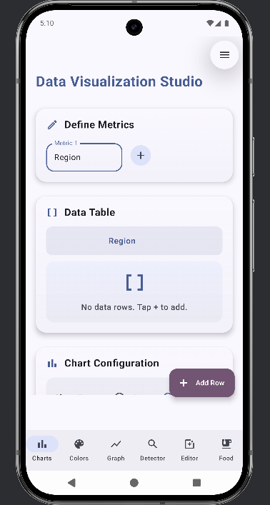
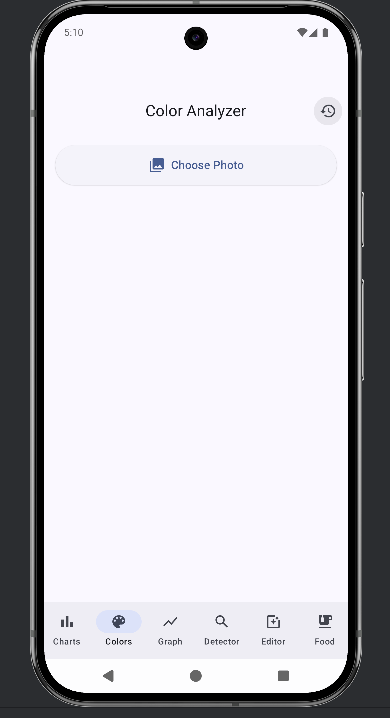
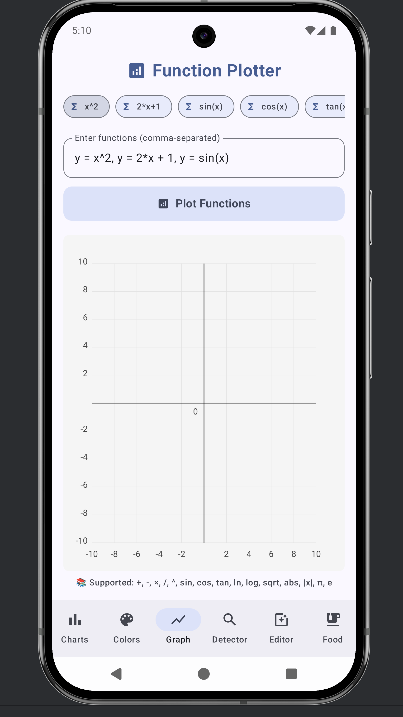
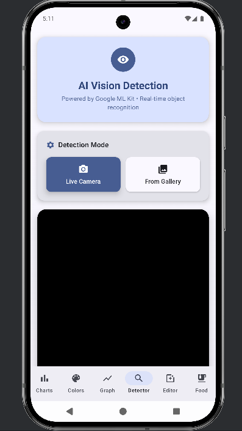
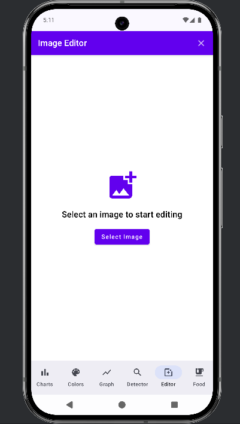
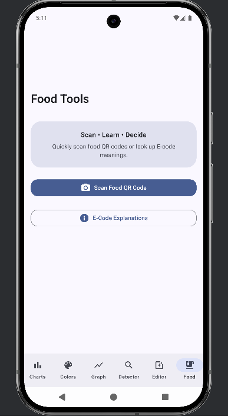

# Multi-Feature Application 

## Overview
The **Multi-Feature Application** is a comprehensive Android app built with **Kotlin** and **Jetpack Compose**, offering a suite of tools for data visualization, image editing, AI-powered vision detection, and more. Designed with a modular architecture, the app ensures scalability, maintainability, and a seamless user experience.

---

## Key Features

### 1. Charts
- Interactive data visualization with bar, line, and pie charts.
- Customizable chart styles and themes.

### 2. Color Analyzer
- Extract RGB, HEX, and HSL values from images or live camera feed.
- Identify dominant and complementary colors.

### 3. Function Plotter
- Plot mathematical functions, including linear, quadratic, and trigonometric.
- Zoom and pan for detailed analysis.

### 4. AI Vision Detection
- Detect objects in images or live camera feed using AI.
- Provides labels and confidence scores for detected objects.

### 5. Image Editor
- Transformations: Crop, Rotate, Resize.
- Adjustments: RGB balance, Brightness, Contrast, Saturation.
- Filters: Apply custom filters to enhance images.
- Save edited images to the gallery or as new files.

### 6. Food Tools
- **QR Code Scanner**: Scan food-related QR codes for quick information.
- **E-Code Explainer**: Look up and understand the meaning of food E-codes.

---

## Screenshots
| **Charts**                        | **Color Analyzer**                        | **Function Plotter**                       |
|-----------------------------------|-------------------------------------------|--------------------------------------------|
|  |  |  |

| **AI Vision Detection**                | **Image Editor**                             | **Food Tools**                           |
|----------------------------------------|----------------------------------------------|------------------------------------------|
|  |  |  |

---

## Architecture
The app follows a **modular architecture** with the following layers:
- **UI Layer**: Built with Jetpack Compose for a modern, declarative UI.
- **Domain Layer**: Contains business logic and use cases.
- **Data Layer**: Handles data sources, including Firebase Firestore and local storage.

### Key Design Patterns
- **MVVM (Model-View-ViewModel)**: Ensures separation of concerns and testability.
- **State Management**: Uses Compose's `remember` and `LaunchedEffect` for reactive state handling.

---

## Technology Stack
- **Programming Language**: Kotlin
- **UI Framework**: Jetpack Compose
- **State Management**: Compose `remember` and `LaunchedEffect`
- **Navigation**: Jetpack Navigation Compose
- **Image Processing**: Android `Bitmap` API
- **AI/ML**: TensorFlow Lite for vision detection
- **Data Visualization**: MPAndroidChart library
- **Backend Integration**: Firebase Firestore

---

## Installation

### Prerequisites
- **Android Studio**: Version 2024.3.1 (Meerkat) or later.
- **JDK**: Java 11 or higher.
- **Gradle**: Version 7.0 or higher.

### Steps
1. Clone the repository:
   ```bash
   git clone https://github.com/KotlinFirestore-PracticalTraining/kotlin-firestore-data-viz.git